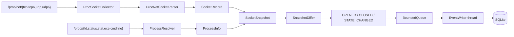

# NetWatch

[](https://github.com/ShayaanRashedin/netwatch/actions/workflows/ci.yml)

NetWatch is a Linux network and process observability agent written in modern
C++. It collects TCP and UDP sockets across IPv4 and IPv6, correlates them with
their owning processes, emits timestamped lifecycle events, and persists those
events asynchronously to SQLite.

The project is built as a production-oriented observability pipeline rather
than a wrapper around `ss` or `netstat`. Linux collection, deterministic event
detection, bounded backpressure, and durable storage are separate components so
they can be tested and evolved independently.

## Current capabilities

- Parses `/proc/net/tcp`, `tcp6`, `udp`, and `udp6`
- Normalizes IPv4 and IPv6 endpoints, ports, states, queues, and socket inodes
- Correlates socket inodes through `/proc/<pid>/fd`
- Captures PID, real UID, username, process name, executable, command line, and
  process start time
- Builds enriched snapshots using a composite socket identity
- Emits `OPENED`, `CLOSED`, and `STATE_CHANGED` lifecycle events
- Preserves prior process metadata when a socket closes
- Runs continuously with configurable polling and graceful signal handling
- Sends events through a bounded, thread-safe queue with producer backpressure
- Writes events and related process metadata on a background SQLite writer
- Drains queued events cleanly during shutdown
- Applies configurable age-based retention and queries recent event history
- Handles disappearing processes, malformed records, shared sockets, duplicate
  descriptors, and missing procfs tables without terminating collection
- Uses injected procfs roots and temporary databases for deterministic tests
- Builds with strict compiler warnings and runs tests in GitHub Actions

## Architecture



The monitoring thread never performs database writes. It submits complete
events to a capacity-limited queue, while a dedicated consumer writes each
event and its process owners in one transaction. Closing the queue wakes the
consumer and lets it drain every accepted event before the process exits.

## SQLite data model

NetWatch creates and migrates its schema automatically:

- `socket_events` stores the timestamp, event type, address family, protocol,
  endpoints, state transition, inode, and queue sizes.
- `event_processes` stores every process owner captured with an event and uses a
  cascading foreign key to its socket event.
- indexes support newest-first history and inode-focused investigation.
- WAL mode, a busy timeout, and per-event transactions provide durable writes
  without blocking collection on normal disk latency.

## Requirements

- Linux
- A C++20 compiler
- CMake 3.25 or newer
- Ninja
- SQLite 3 development headers
- Git (CMake fetches Catch2 when tests are enabled)

On Ubuntu:

```bash
sudo apt update
sudo apt install -y build-essential cmake ninja-build git libsqlite3-dev sqlite3
```

## Build and test

```bash
cmake -S . -B build/debug -G Ninja -DCMAKE_BUILD_TYPE=Debug
cmake --build build/debug
ctest --test-dir build/debug --output-on-failure
```

## Run

Print one enriched snapshot without creating a database:

```bash
./build/debug/netwatch --once
```

Monitor continuously and persist events to `netwatch.db`:

```bash
./build/debug/netwatch
```

Choose the database, polling interval, queue capacity, and retention period:

```bash
./build/debug/netwatch \
  --database data/netwatch.db \
  --interval-ms 500 \
  --queue-capacity 4096 \
  --retention-days 30
```

Use `--retention-days 0` to disable automatic pruning. Monitor without SQLite:

```bash
./build/debug/netwatch --no-persist
```

Print the 25 newest persisted events and exit:

```bash
./build/debug/netwatch --database netwatch.db --history 25
```

Show all options:

```bash
./build/debug/netwatch --help
```

Example lifecycle event:

```text
[2026-08-27T18:05:42Z] OPENED TCP IPv4 127.0.0.1:8080 -> 0.0.0.0:0 LISTEN inode=32808 tx=0 rx=0 owner={pid=4854 process=python3}
```

Process ownership can be unavailable because of Linux permissions or because a
process exits while a snapshot is being collected. Run with suitable
permissions when a system-wide view is required.

## Inspect the database

The built-in history command is the normal read path. You can also inspect the
schema and aggregate the event stream with the SQLite CLI:

```bash
sqlite3 netwatch.db ".schema"
sqlite3 netwatch.db \
  "SELECT event_type, COUNT(*) FROM socket_events GROUP BY event_type;"
```

Database files and their WAL sidecars are excluded by `.gitignore`.

## Repository layout

```text
include/netwatch/concurrency/  Bounded thread-safe queue
include/netwatch/core/         Domain models and enriched snapshots
include/netwatch/monitoring/   Snapshot comparison and lifecycle events
include/netwatch/persistence/  Background event writer
include/netwatch/procfs/       Procfs parser, collector, and resolver interfaces
include/netwatch/storage/      SQLite repository interface
src/core/                      Snapshot construction
src/monitoring/                Event generation
src/persistence/               Asynchronous persistence worker
src/procfs/                    Linux procfs implementations
src/storage/                   SQLite schema and queries
tests/unit/                    Deterministic unit and concurrency tests
.github/workflows/             Continuous integration
```

## Roadmap

- [x] IPv4/IPv6 TCP and UDP procfs parsing
- [x] Process-to-socket correlation and identity metadata
- [x] Enriched snapshots with stable composite socket keys
- [x] Socket lifecycle and state-change events
- [x] Continuous polling and graceful shutdown
- [x] Bounded event queue and background persistence
- [x] SQLite event/process storage, retention, and history queries
- [x] Unit tests and Linux CI
- [ ] Behavioral detections and alert scoring
- [ ] REST/WebSocket API and dashboard
- [ ] systemd service, container packaging, demo, and release documentation

## Status

NetWatch now provides a working collection-to-storage observability pipeline.
The next milestone adds behavioral detections and explainable alert scoring on
top of the persisted event stream.

