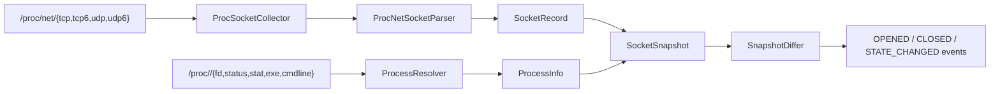

# NetWatch

[](https://github.com/ShayaanRashedin/netwatch/actions/workflows/ci.yml)

NetWatch is a Linux network and process observability agent written in modern C++.
It collects TCP and UDP sockets across IPv4 and IPv6, correlates them with their
owning processes, and emits timestamped lifecycle events as sockets open, close,
or change state.

The project is being built as a production-oriented observability system rather
than a wrapper around `ss` or `netstat`. Its collection and event layers are
designed to support later persistence, detection, API, and visualization
components.

## Current capabilities

- Parses `/proc/net/tcp`, `tcp6`, `udp`, and `udp6`
- Normalizes IPv4 and IPv6 endpoints, ports, states, queues, and socket inodes
- Correlates socket inodes through `/proc/<pid>/fd`
- Captures PID, real UID, username, process name, executable, command line, and
  process start time
- Builds enriched snapshots using a composite socket identity
- Emits `OPENED`, `CLOSED`, and `STATE_CHANGED` lifecycle events
- Preserves process metadata from the previous snapshot for closed sockets
- Supports one-shot collection and continuous configurable polling
- Handles Ctrl+C and SIGTERM gracefully
- Handles shared sockets, duplicate file descriptors, disappearing processes,
  malformed records, and missing procfs tables without terminating collection
- Uses injected procfs roots for deterministic unit testing
- Builds with strict compiler warnings and runs tests in GitHub Actions

## Architecture



The parser operates on streams, collectors accept configurable procfs roots,
and snapshot comparison is isolated from Linux I/O. This keeps the event engine
deterministic and independently testable.

## Requirements

- Linux
- A C++20 compiler
- CMake 3.25 or newer
- Ninja
- Git (CMake fetches Catch2 when tests are enabled)

On Ubuntu:

```bash
sudo apt update
sudo apt install -y build-essential cmake ninja-build git
```

## Build and test

```bash
cmake -S . -B build/debug -G Ninja -DCMAKE_BUILD_TYPE=Debug
cmake --build build/debug
ctest --test-dir build/debug --output-on-failure
```

## Run

Print one enriched snapshot and exit:

```bash
./build/debug/netwatch --once
```

Continuously monitor with the default one-second interval:

```bash
./build/debug/netwatch
```

Use a custom polling interval between 50 and 3,600,000 milliseconds:

```bash
./build/debug/netwatch --interval-ms 500
```

Show command-line help:

```bash
./build/debug/netwatch --help
```

Example one-shot output:

```text
TCP IPv4 127.0.0.1:8080 -> 0.0.0.0:0 LISTEN inode=32808 tx=0 rx=0 owner={pid=4854 process=python3 uid=1000 user=shayaan exe=/usr/bin/python3 cmd="python3 -m http.server 8080" start_ticks=113149}
UDP IPv6 [::]:5353 -> [::]:0 UNCONN inode=42100 tx=0 rx=0 owner=unknown
```

Example lifecycle event:

```text
[2026-08-27T18:05:42Z] OPENED TCP IPv4 127.0.0.1:8080 -> 0.0.0.0:0 LISTEN inode=32808 tx=0 rx=0 owner={pid=4854 process=python3}
```

Process ownership can be unavailable because of Linux permissions or because a
process exits while a snapshot is being collected. Run with suitable
permissions when a system-wide view is required.

## Repository layout

```text
include/netwatch/core/        Domain models and enriched snapshots
include/netwatch/monitoring/  Snapshot comparison and lifecycle events
include/netwatch/procfs/      Procfs parser, collector, and resolver interfaces
src/core/                     Snapshot construction
src/monitoring/               Event generation
src/procfs/                   Linux procfs implementations
tests/unit/                   Deterministic unit tests
.github/workflows/            Continuous integration
```

## Roadmap

- [x] IPv4/IPv6 TCP and UDP procfs parsing
- [x] Process-to-socket correlation and identity metadata
- [x] Enriched snapshots with stable composite socket keys
- [x] Socket lifecycle and state-change events
- [x] Continuous polling and graceful shutdown
- [x] Unit tests and Linux CI
- [ ] Bounded event queue and background persistence
- [ ] SQLite event and process storage
- [ ] Behavioral detections and alert scoring
- [ ] REST/WebSocket API and dashboard
- [ ] systemd service, container packaging, demo, and release documentation

## Status

NetWatch currently provides working collection and event-generation layers. The
next milestone adds asynchronous processing and durable SQLite persistence.
