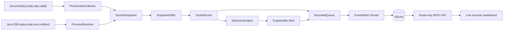

# NetWatch

[](https://github.com/ShayaanRashedin/netwatch/actions/workflows/ci.yml)

NetWatch is a Linux network and process observability agent written in modern
C++. It collects TCP and UDP sockets across IPv4 and IPv6, correlates them with
their owning processes, emits lifecycle events, detects suspicious behavior,
persists explainable alerts to SQLite, and exposes the evidence through a
read-only REST API and live browser dashboard.

The project is a production-oriented observability pipeline rather than a
wrapper around `ss` or `netstat`. Collection, deterministic event detection,
behavioral analysis, bounded backpressure, and durable storage are separate
components with dedicated tests.

## Current capabilities

- Parses `/proc/net/tcp`, `tcp6`, `udp`, and `udp6`
- Normalizes IPv4/IPv6 endpoints, states, queue sizes, and socket inodes
- Correlates socket inodes through `/proc/<pid>/fd`
- Captures PID, UID, username, process name, executable, command line, and
  process start time
- Emits `OPENED`, `CLOSED`, and `STATE_CHANGED` lifecycle events
- Preserves prior process metadata when sockets disappear
- Detects suspicious listeners on commonly abused ports
- Detects unexpected public listeners in the dynamic port range
- Detects rapid per-process TCP connection bursts
- Detects repeated incomplete TCP handshakes
- Detects network activity from temporary or deleted executables
- Assigns deterministic 0-100 risk scores and severity bands
- Produces human-readable reasons and structured evidence for every alert
- Uses process start time with PID to avoid mixing behavior after PID reuse
- Suppresses repeat alerts with per-rule, per-subject cooldowns
- Sends event/alert batches through a bounded thread-safe queue
- Writes normalized event, process, alert, and evidence records to SQLite
- Drains accepted writes during graceful shutdown
- Supports retention plus event and filtered alert-history queries
- Serves health, summary, event, and risk-filtered alert JSON endpoints
- Reads safely beside the writer through independent SQLite WAL connections
- Includes a responsive dashboard with severity metrics, rule distribution,
  explainable alert cards, and a process-aware event table
- Validates and bounds every public API query parameter
- Applies restrictive browser security headers and binds to loopback by default
- Runs strict-warning builds and deterministic tests in GitHub Actions

## Architecture



The monitoring thread performs collection and deterministic analysis but never
writes to disk. Each event and its generated alerts enter the queue as one
batch. The background writer stores the event, owners, alerts, and evidence in
a single transaction, so an alert cannot be separated from its source event.
The API runs as a separate process with its own SQLite connection; WAL mode lets
it serve live reads while the agent continues writing.

## Detection rules

| Rule | Default score | What it identifies |
|---|---:|---|
| `suspicious-listening-port` | 45-70 | TCP listener on a commonly abused port; non-loopback exposure raises the score |
| `unusual-public-listener` | 35 | Non-loopback listener in the dynamic port range |
| `rapid-connection-burst` | 60 | One process opens at least 20 TCP connections within 10 seconds |
| `repeated-failed-connections` | 55 | One process accumulates 5 incomplete handshakes within 30 seconds |
| `temporary-executable-network-activity` | 85 | Network socket opened by an executable under `/tmp`, `/var/tmp`, or `/dev/shm` |
| `deleted-executable-network-activity` | 80 | Network socket opened by a running executable marked deleted |

Risk-score severity bands are stable and test-covered:

- `LOW`: 0-24
- `MEDIUM`: 25-49
- `HIGH`: 50-74
- `CRITICAL`: 75-100

These are transparent behavioral signals, not claims that a process is
malicious. Every alert includes the exact rule, reason, process/socket context,
window count where relevant, and source event.

## SQLite data model

- `socket_events`: lifecycle timestamp, event type, endpoints, state transition,
  inode, and queue sizes
- `event_processes`: process owners captured with the source event
- `alerts`: rule, title, reason, risk score, severity, detection timestamp, and
  source-event foreign key
- `alert_evidence`: ordered evidence strings associated with an alert

Foreign-key cascades keep retention consistent across events, processes,
alerts, and evidence. WAL mode, a busy timeout, indexes, and per-event
transactions provide durable writes without normal disk latency blocking
collection.

## Requirements

- Linux
- A C++20 compiler
- CMake 3.25 or newer
- Ninja
- SQLite 3 development headers
- Git (CMake fetches Catch2 when tests are enabled)

On Ubuntu:

```bash
sudo apt update
sudo apt install -y build-essential cmake ninja-build git libsqlite3-dev sqlite3
```

## Build and test

```bash
cmake -S . -B build/debug -G Ninja -DCMAKE_BUILD_TYPE=Debug
cmake --build build/debug
ctest --test-dir build/debug --output-on-failure
```

## Run

Print one enriched snapshot without creating a database:

```bash
./build/debug/netwatch --once
```

Monitor, detect, and persist to `netwatch.db`:

```bash
./build/debug/netwatch
```

Choose runtime storage settings:

```bash
mkdir -p data
./build/debug/netwatch \
  --database data/netwatch.db \
  --interval-ms 500 \
  --queue-capacity 4096 \
  --retention-days 30
```

Use `--retention-days 0` to disable pruning, or monitor without SQLite:

```bash
./build/debug/netwatch --no-persist
```

Print recent events:

```bash
./build/debug/netwatch --database netwatch.db --history 25
```

Print recent alerts, optionally filtering by minimum risk score:

```bash
./build/debug/netwatch --database netwatch.db --alerts 25
./build/debug/netwatch --database netwatch.db --alerts 25 --min-score 50
```

Example alert:

```text
[2026-08-29T19:12:04Z] ALERT severity=HIGH score=70 rule=suspicious-listening-port title="Suspicious TCP listening port"
  reason: A TCP service began listening on a commonly abused port and is reachable beyond loopback.
  evidence: local=0.0.0.0:4444 remote=0.0.0.0:0
  evidence: listener_scope=non-loopback
```

### Start the API and dashboard

Run the agent and API against the same database in separate terminals. First,
start collection and detection:

```bash
./build/debug/netwatch --database netwatch.db --interval-ms 500
```

Then start the read-only API and dashboard:

```bash
./build/debug/netwatch_api --database netwatch.db
```

Open [http://127.0.0.1:8088](http://127.0.0.1:8088). The dashboard refreshes
every three seconds and can be paused or filtered by alert risk score.

Use a different bind address or port when required:

```bash
./build/debug/netwatch_api \
  --database netwatch.db \
  --listen 0.0.0.0 \
  --port 8088
```

Loopback is the secure default. Binding to `0.0.0.0` exposes the dashboard to
the network and should only be done behind appropriate host/network controls.

## REST API

| Endpoint | Description |
|---|---|
| `GET /api/health` | Service health and API version |
| `GET /api/summary` | Counts, severity totals, latest timestamps, and rule distribution |
| `GET /api/events?limit=50` | Newest lifecycle events with process owners |
| `GET /api/alerts?limit=25&min_score=50` | Alerts with reasons, evidence, and source events |

`limit` must be between 1 and 500; `min_score` must be between 0 and 100.
Invalid input returns a JSON `400` response. API responses use `no-store`, and
the server adds content-type, frame, referrer, and Content Security Policy
headers to the dashboard origin.

Process ownership can be unavailable because of Linux permissions or because a
process exits while a snapshot is collected. Run with suitable permissions when
a system-wide view is required.

## Inspect the database

```bash
sqlite3 netwatch.db ".schema"
sqlite3 netwatch.db \
  "SELECT severity, rule_id, COUNT(*) FROM alerts GROUP BY severity, rule_id;"
```

Database files and WAL sidecars are excluded by `.gitignore`.

## Repository layout

```text
include/netwatch/api/          Read-only JSON service and HTTP server
include/netwatch/concurrency/  Bounded thread-safe queue
include/netwatch/core/         Domain models and enriched snapshots
include/netwatch/detection/    Alert model, scoring, and behavioral engine
include/netwatch/monitoring/   Snapshot comparison and lifecycle events
include/netwatch/persistence/  Background event/alert writer
include/netwatch/procfs/       Procfs collection and process resolution
include/netwatch/storage/      SQLite repository interface
src/api/                       REST serialization and HTTP routing
src/detection/                 Detection rules and explainable scoring
src/storage/                   SQLite schema, retention, and history queries
tests/unit/                    Deterministic unit, storage, and concurrency tests
web/                           Dependency-free responsive dashboard
.github/workflows/             Continuous integration
```

## Roadmap

- [x] IPv4/IPv6 TCP and UDP collection
- [x] Process correlation and identity metadata
- [x] Socket lifecycle and state-change events
- [x] Continuous polling and graceful shutdown
- [x] Bounded asynchronous SQLite persistence
- [x] Event/process storage, retention, and history
- [x] Behavioral detection and explainable alert scoring
- [x] Alert/evidence persistence and filtered history
- [x] Unit tests and Linux CI
- [x] Read-only REST API and live dashboard
- [ ] systemd service, container packaging, demo, and release documentation

## Status

NetWatch now provides a working collection-to-detection-to-storage-to-dashboard
pipeline. The final milestone focuses on systemd service deployment, container
packaging, demo assets, and release documentation.

