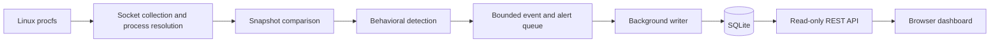

# NetWatch

### Linux network observability, behavioral detection, and a live dashboard

NetWatch is a C++20 application that connects network activity to the processes responsible for it. It reads Linux socket information, tracks connection changes, applies explainable detection rules, and stores events and alerts in SQLite. A read-only REST API and browser dashboard make that evidence accessible for investigation.

The project brings together systems programming, concurrent processing, database design, backend development, and deployment automation in one collection-to-dashboard pipeline.

**Technology:** C++20 · Linux procfs · SQLite · REST/JSON · JavaScript · HTML/CSS · CMake · Catch2 · Docker · systemd · GitHub Actions

## Engineering highlights

- **Process-aware monitoring:** correlates IPv4/IPv6 TCP and UDP sockets with process IDs, users, executables, command lines, and process start times.
- **Explainable detection:** produces rule-based alerts with risk scores, severity, reasons, and supporting evidence.
- **Concurrent persistence:** separates monitoring from SQLite writes through a bounded queue and a dedicated writer thread.
- **Consistent event storage:** writes each event and its associated alerts in one transaction, retaining the connection between a finding and its evidence.
- **Accessible investigation:** exposes event history and filtered alerts through a REST API and a dependency-free web dashboard.
- **Delivery automation:** includes tests, installation checks, container builds, native service definitions, and release packaging workflows.

## Architecture



Snapshots are compared to identify `OPENED`, `CLOSED`, and `STATE_CHANGED` events. Previous process metadata is retained when a socket disappears. The detection engine uses PID and process start time together to avoid combining activity from different processes after PID reuse.

The queue makes backpressure explicit when persistence falls behind. Accepted writes are drained during graceful shutdown. The API runs separately from the agent, using its own SQLite connection; WAL mode supports reads alongside ongoing writes.

## Skills developed and demonstrated

| Area | Evidence in the project |
| --- | --- |
| Linux systems programming | Parsing `/proc/net/*`, resolving socket inodes through process file descriptors, and handling disappearing processes and permission boundaries. |
| Modern C++ and software design | Separate domain models, collectors, detection, persistence, and API components under `include/netwatch/` and `src/`. |
| Concurrency and resource management | A bounded thread-safe queue, background persistence, shutdown coordination, and tests for queue draining. |
| Detection engineering | Time-window rules, process identity tracking, repeat-alert cooldowns, deterministic scores, and evidence generation. |
| SQL and data modeling | Related event, process, alert, and evidence tables; transactions; foreign keys; retention; and history queries. |
| Backend and frontend development | JSON serialization, bounded query parameters, HTTP routing, and a periodically refreshed JavaScript dashboard. |
| Testing and delivery | Catch2 tests, CTest, strict compiler warnings, GitHub Actions, Docker, CPack archives, and systemd packaging. |

## Detection capabilities

| Signal | Behavior evaluated |
| --- | --- |
| Suspicious listening port | TCP listeners on commonly abused ports, with higher scores for exposure beyond loopback. |
| Unusual public listener | Non-loopback listeners in the dynamic port range. |
| Rapid connection burst | At least 20 TCP connection openings by one process within 10 seconds by default. |
| Repeated incomplete handshakes | Five incomplete handshakes by one process within 30 seconds by default. |
| Temporary executable activity | Network activity from executables under `/tmp`, `/var/tmp`, or `/dev/shm`. |
| Deleted executable activity | Network activity from a running executable marked as deleted. |

Scores range from 0 to 100: **LOW** 0–24, **MEDIUM** 25–49, **HIGH** 50–74, and **CRITICAL** 75–100. These signals support investigation; they do not establish that a process is malicious.

## Build and run

### Requirements

Use Linux, including a suitable Linux VM or WSL environment. The build requires a C++20 compiler, CMake 3.25+, Ninja, Git, and SQLite development headers. CMake downloads pinned versions of `cpp-httplib`, `nlohmann/json`, and Catch2 when tests are enabled, so initial configuration requires internet access.

On Ubuntu 24.04:

```bash
sudo apt update
sudo apt install -y build-essential cmake ninja-build git libsqlite3-dev sqlite3

git clone https://github.com/ShayaanRashedin/netwatch.git
cd netwatch
cmake --preset debug
cmake --build --preset debug
ctest --preset debug
```

Inspect one snapshot without creating a database:

```bash
./build/debug/netwatch --once
```

Start continuous collection in one terminal:

```bash
./build/debug/netwatch --database netwatch.db --interval-ms 500
```

From the same project directory in another terminal, start the API:

```bash
./build/debug/netwatch_api --database netwatch.db
```

Open [the dashboard](http://127.0.0.1:8088). It displays severity summaries, detection-rule distribution, alert evidence, and process-aware event history.

Query recorded alerts directly:

```bash
./build/debug/netwatch --database netwatch.db --alerts 25 --min-score 50
```

## REST API

| Endpoint | Purpose |
| --- | --- |
| `GET /api/health` | Service health and API version. |
| `GET /api/summary` | Aggregate counts, severity totals, and rule distribution. |
| `GET /api/events?limit=50` | Recent socket lifecycle events and process owners. |
| `GET /api/alerts?limit=25&min_score=50` | Filtered alerts with reasons and evidence. |

`limit` accepts 1–500 and `min_score` accepts 0–100. Invalid values return a JSON `400` response. The server applies restrictive browser headers and disables caching of API responses.

## Testing and deployment

The test suite covers parsing, process resolution, snapshot comparison, detection, queue behavior, persistence, and API service behavior. The CI workflow also checks shell syntax, installs and smoke-tests the application, creates a CPack archive, validates Compose configuration, and builds the Docker image.

For an optimized native build:

```bash
cmake --preset release
cmake --build --preset release
sudo cmake --install build/release
```

For the included Linux container setup:

```bash
docker compose up --build -d
curl --fail http://127.0.0.1:8088/api/health
```

The Compose agent uses host network and PID visibility. Native systemd definitions are under `packaging/systemd/`, and the tag-triggered release workflow packages archives with SHA-256 checksums.

## Project layout

```text
include/netwatch/   Public interfaces, models, and queue implementation
src/               Collection, detection, persistence, API, and entry points
tests/unit/        Unit, storage, and concurrency tests
web/               Dashboard HTML, CSS, and JavaScript
packaging/systemd/ Native service units and example configuration
scripts/           Installation, demonstration, and smoke-test scripts
.github/workflows/ CI and release automation
```

## Scope and tradeoffs

- Polling can miss connections that begin and end between snapshots; this is socket observability rather than packet capture.
- Process visibility depends on Linux permissions and whether the process still exists during collection.
- Detection uses transparent heuristics rather than a trained model or a threat-intelligence feed.
- The API has no user authentication and defaults to loopback. Database records can contain sensitive process and network metadata.
- Bounded buffering controls memory use, but sustained storage pressure can slow collection.
